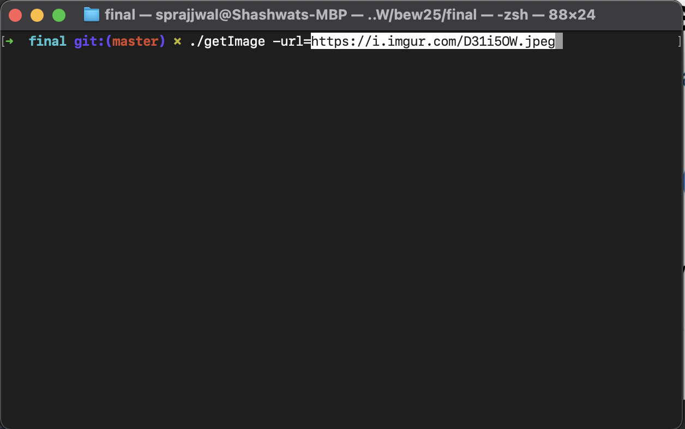
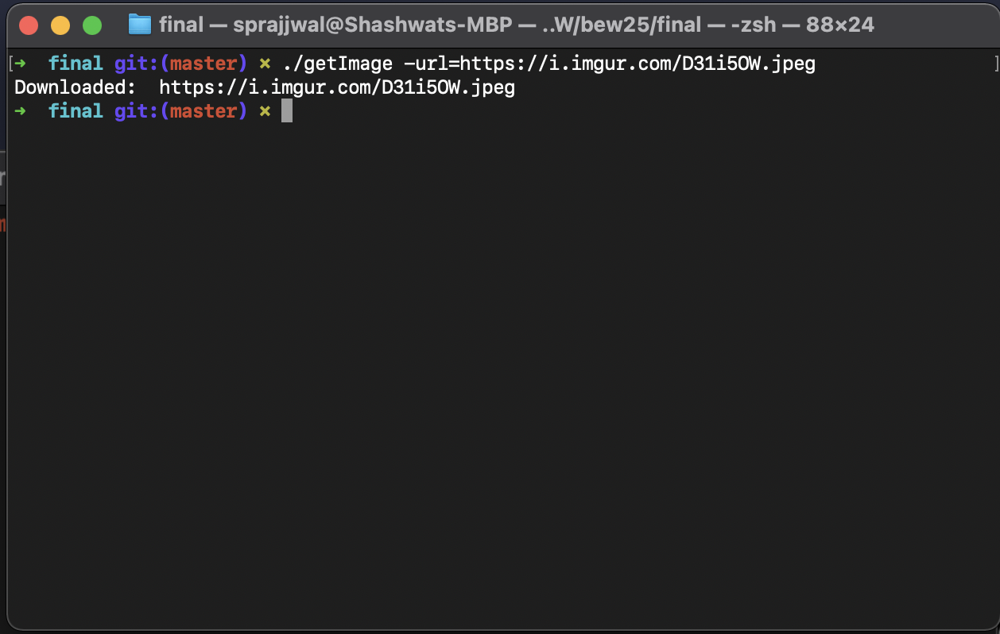
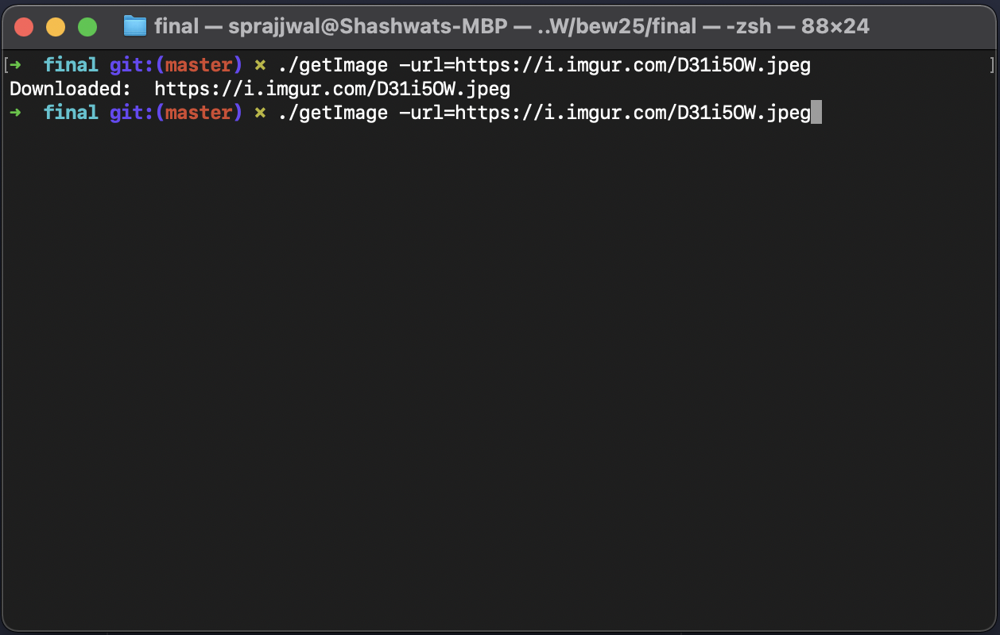
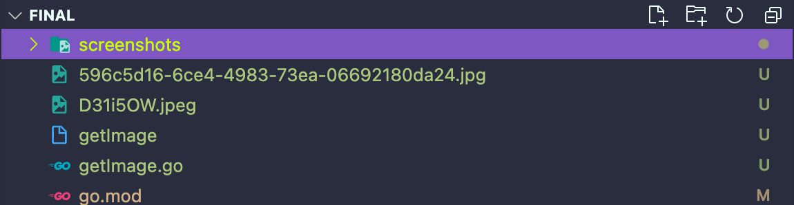
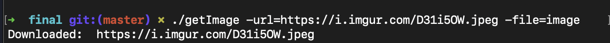
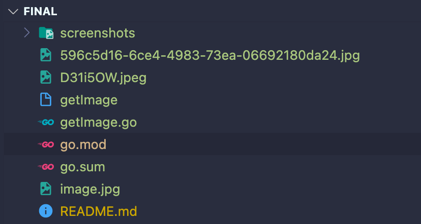

# Image downloader tool

## Problem

Here at *Advertising Startup* we have to work with stock images all the time. The Image downloader CLI tool downloads any JPG from a given URL. Additionally it can take file names to name the downloaded image as a flag `-file`

## Usage

1. Clone the repo.
2. Call the CLI using `./getImage -url=<URL> -file=<file>`

## Example

Using only the `url` flag.

Image Download Confirmation.

When trying to download images that might have the same file name as existing one

Random file name gets assigned for existing files.

Additionally images can be downloaded with custom names like this.

This creates `image.jpg` for us.
